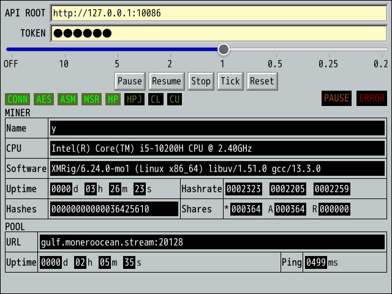
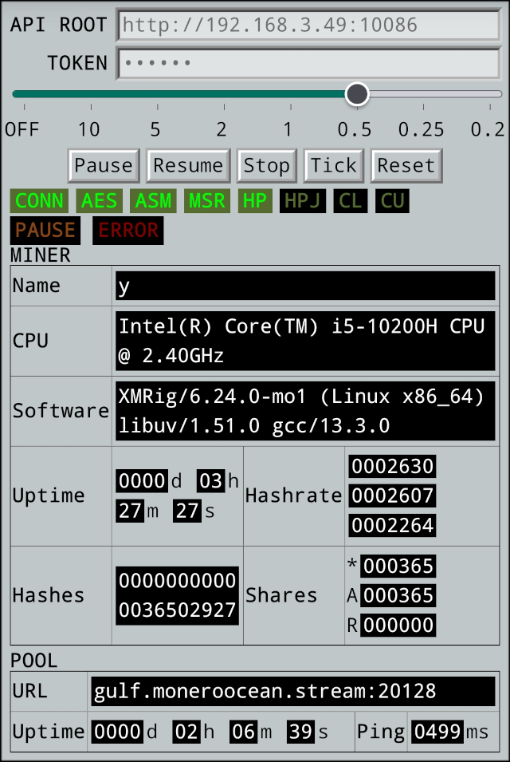

# XMRig Control Panel

Simple XMRig console in a standalone webpage. No deployment required, no external resources required, just open it directly with the web browser.





## Usage

Open `xmrigconsole.html` in a web browser. You can either double-click it, drag it into the browser's window, or drop it onto a web server and access it via URL.

## Deployment

This is not a required step. The following demonstrates how to set up a web server locally using Python or Node.js (assuming your workdir is the directory where `xmrigconsole.html` is located):

Using Python:
```bash
python3 -m http.server
# Access it via http://127.0.0.1:8000/xmrigconsole.html
```

Using Node.js:
```bash
npx http-server
# Access it via http://127.0.0.1:8080/xmrigconsole.html
```
